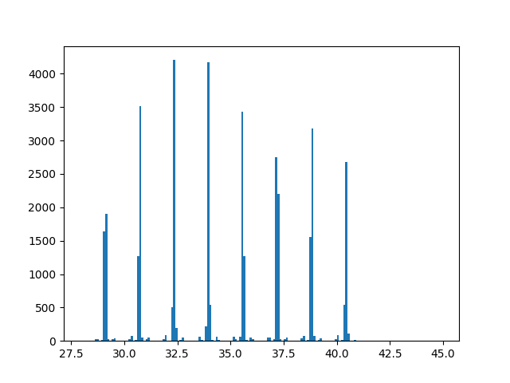

# Various WoW: Classic data
**Data is based on Warcraftlogs crawls. This repository contains shortened results, as well as full data and script that was used to crawl data.**

## Resistance values of bosses and/or trash in 40-man raids - mostly 24
**[Link to script](partials.py)**\
**[Results for AQ - temporary, will update later](https://pastebin.com/y14f587M)**
 Script currently does not work for Chromaggus and Shazzrah. Schools available are Fire and Shadow.\
Both AQ and BWL bosses seem to have 24 level-based resistance, which cant be mitigated with spell penetration (will post about it later).\
 MC bosses are mostly same, excluding Gehennas and Golemagg.
 
## Wands are using spellhit from gear, Elemental Precision does not count
**[Link to script](wand_hit_check.py)**\
**[Results for p4 / Chromaggus](crawl-data/wandsp4.md)**\
**[Results for p5 / Viscidus](https://pastebin.com/NBdwXpdB)**
 This script was used to check wands on Chromaggus from p4 logs (since wands behavior may have been changed in p5).\
Looks like wands always was using spellhit from gear.\
Results are not exactly correlating with estimated values for given hit, but are pretty linear to assume they benefit from spellhit.

## Twin Emperors TP timers (29-41 seconds)
**[Link to script](twinemp.py)**\
****